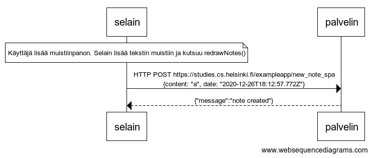

```
note over selain:
Käyttäjä lisää muistiinpanon. Selain lisää tekstin muistiin ja kutsuu redrawNotes()
end note
selain->palvelin: HTTP POST https://studies.cs.helsinki.fi/exampleapp/new_note_spa \n{content: "a", date: "2020-12-26T18:12:57.772Z"}
palvelin-->selain: {"message":"note created"}
```